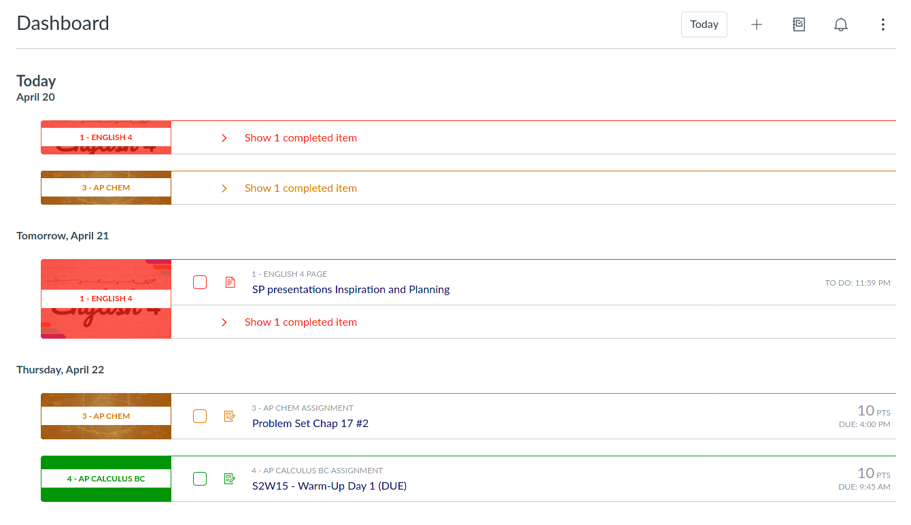

# Canvas-Theme
UserCSS to revert Canvas' planner course title alignment to centered.

## Preview

## Installation
1. Install either
  a. Stylus(recommended): [Firefox](https://addons.mozilla.org/en-US/firefox/addon/styl-us/) [Chrome](https://chrome.google.com/webstore/detail/stylus/clngdbkpkpeebahjckkjfobafhncgmne) [Opera](https://addons.opera.com/en-gb/extensions/details/stylus/)
  b. xStyle: [Firefox](https://addons.mozilla.org/firefox/addon/xstyle/) [Chrome](https://chrome.google.com/webstore/detail/xstyle/hncgkmhphmncjohllpoleelnibpmccpj).
2. [Install the UserCSS](https://github.com/rjacoby00/Canvas-Theme/raw/master/canvas-revert-title-alignment.user.css)
